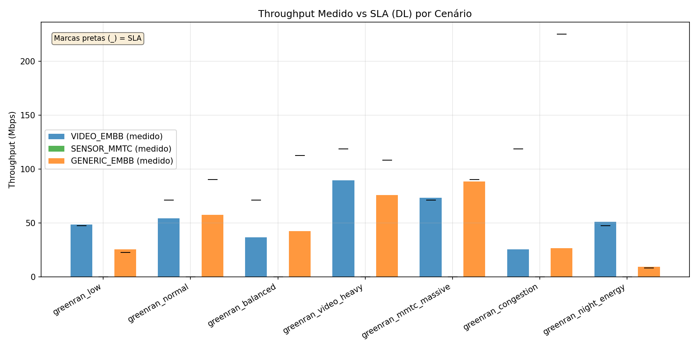
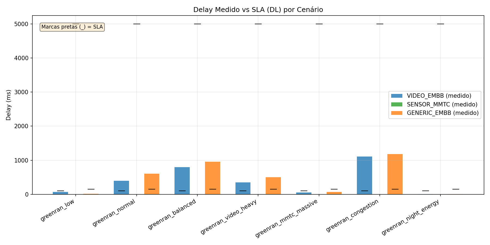
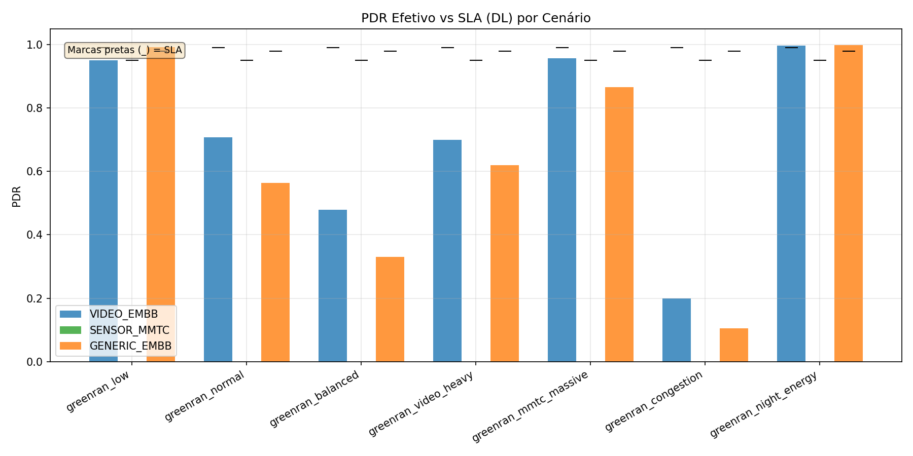
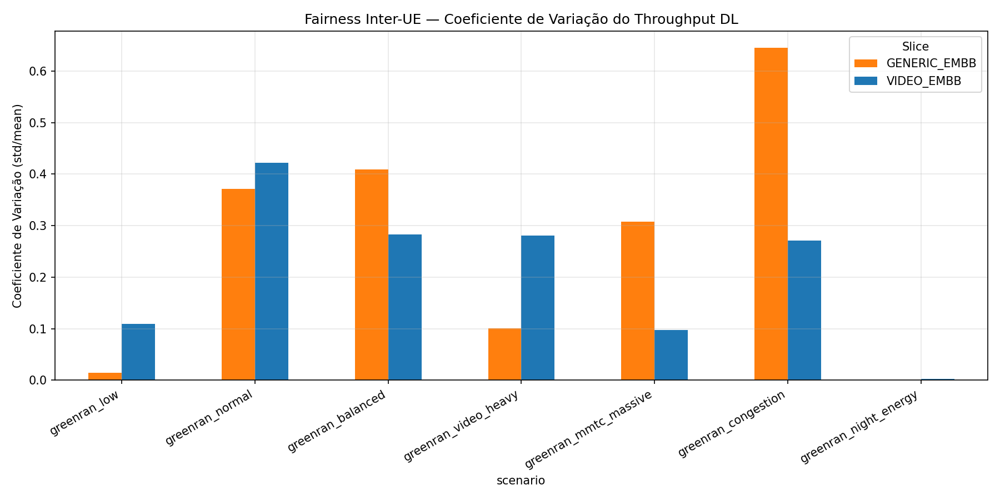
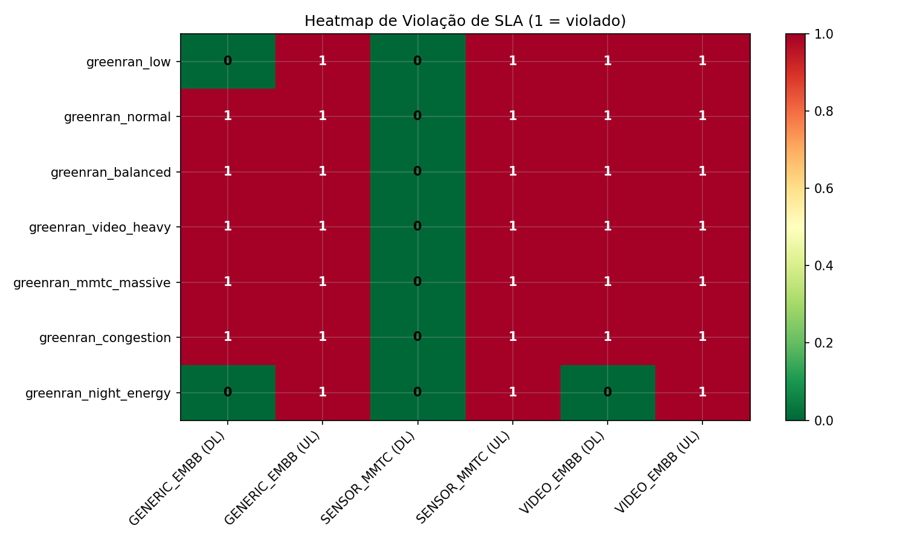
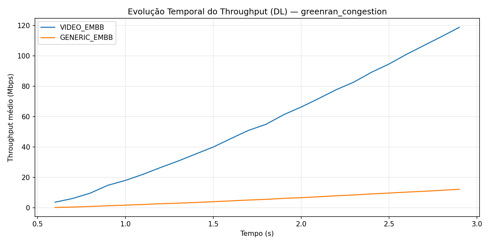
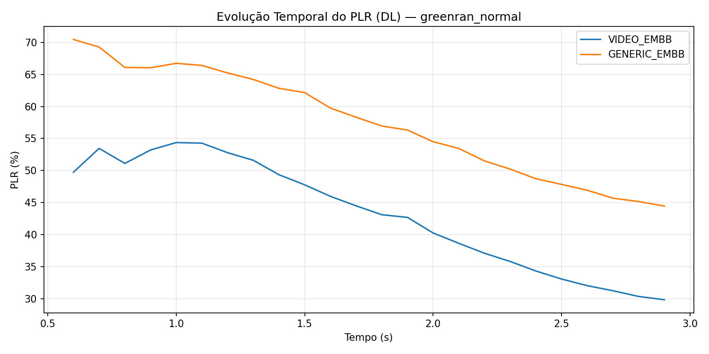

# Relatório de Análise — GreenRAN Slice-Aware Scenarios

**Data de geração:** 2026-05-07 21:14

## 1. Resumo Executivo

Este relatório apresenta uma análise comparativa dos sete cenários de simulação do *slice-aware scheduler* implementado no ns-3 com 5G-LENA. O objetivo é avaliar o cumprimento dos SLAs de *throughput*, *delay* e *PDR* (Packet Delivery Ratio) para três classes de slice — **VIDEO_EMBB** (vídeo vigilância), **SENSOR_MMTC** (IoT) e **GENERIC_EMBB** (usuários gerais) — sob diferentes condições de carga, distribuição de tráfego e políticas de economia de energia.

## 2. Configurações dos Cenários

| Cenário | Seed | UEs Vídeo | UEs Sensor | UEs Genérico | Peso Vídeo | Peso Sensor | Peso Genérico |
|---------|------|-----------|------------|--------------|------------|-------------|---------------|
| greenran_low | 42 | 5 | 8 | 5 | 0.5 | 0.2 | 0.3 |
| greenran_normal | 43 | 5 | 8 | 20 | 0.4 | 0.15 | 0.45 |
| greenran_video_heavy | 44 | 5 | 8 | 15 | 0.5 | 0.1 | 0.4 |
| greenran_mmtc_massive | 45 | 5 | 8 | 20 | 0.4 | 0.15 | 0.45 |
| greenran_congestion | 46 | 5 | 8 | 50 | 0.35 | 0.1 | 0.55 |
| greenran_night_energy | 47 | 5 | 8 | 3 | 0.4 | 0.3 | 0.3 |
| greenran_balanced | 48 | 5 | 8 | 25 | 0.35 | 0.15 | 0.5 |

## 3. Panorama de Violações de SLA

A tabela a seguir condensa o desempenho por cenário. Cada linha da tabela original representa um KPI (delay, PDR ou throughput) para uma direção (DL/UL). A coluna **Taxa de Violação** indica a fração de KPIs que não atingiram o SLA contratado.

| Cenário | KPIs Avaliados | Violações | Taxa de Violação |
|---------|----------------|-----------|------------------|
| greenran_low | 6 | 4 | 66.7% |
| greenran_normal | 6 | 5 | 83.3% |
| greenran_balanced | 6 | 5 | 83.3% |
| greenran_video_heavy | 6 | 5 | 83.3% |
| greenran_mmtc_massive | 6 | 5 | 83.3% |
| greenran_congestion | 6 | 5 | 83.3% |
| greenran_night_energy | 6 | 3 | 50.0% |

### 3.1. Destaques

- **Melhor cenário:** `greenran_night_energy` com taxa de violação de 50.0%.
- **Pior cenário:** `greenran_normal` com taxa de violação de 83.3%.

## 4. Análise Detalhada por Cenário

### 4.1. greenran_low

Configuração com **18 UEs** totais. Pesos estáticos: Video=0.5, Sensor=0.2, Genérico=0.3.

| Slice (Dir) | SLA Delay | Delay Medido | SLA PDR | PDR Medido | SLA Thr | Thr Medido | Violação? |
|-------------|-----------|--------------|---------|------------|---------|------------|-----------|
| GENERIC_EMBB (DL) | 150.0 ms | 11.8 ms | 98.0% | 99.2% | 22.50 Mbps | 25.28 Mbps | 🟢 NÃO |
| GENERIC_EMBB (UL) | 150.0 ms | 36.4 ms | 98.0% | 56.1% | 0.32 Mbps | 0.42 Mbps | 🔴 SIM |
| SENSOR_MMTC (DL) | 5000.0 ms | 0.0 ms | 95.0% | 0.0% | 0.00 Mbps | 0.00 Mbps | 🟢 NÃO |
| SENSOR_MMTC (UL) | 5000.0 ms | 6.7 ms | 95.0% | 75.0% | 0.00 Mbps | 0.00 Mbps | 🔴 SIM |
| VIDEO_EMBB (DL) | 100.0 ms | 67.9 ms | 99.0% | 95.0% | 47.50 Mbps | 48.60 Mbps | 🔴 SIM |
| VIDEO_EMBB (UL) | 100.0 ms | 52.7 ms | 99.0% | 55.0% | 0.00 Mbps | 0.22 Mbps | 🔴 SIM |

**KPIs violados:**
- `GENERIC_EMBB (UL)`: PDR.
- `SENSOR_MMTC (UL)`: PDR.
- `VIDEO_EMBB (DL)`: PDR.
- `VIDEO_EMBB (UL)`: PDR.

### 4.2. greenran_normal

Configuração com **33 UEs** totais. Pesos estáticos: Video=0.4, Sensor=0.15, Genérico=0.45.

| Slice (Dir) | SLA Delay | Delay Medido | SLA PDR | PDR Medido | SLA Thr | Thr Medido | Violação? |
|-------------|-----------|--------------|---------|------------|---------|------------|-----------|
| GENERIC_EMBB (DL) | 150.0 ms | 603.7 ms | 98.0% | 56.4% | 90.00 Mbps | 57.49 Mbps | 🔴 SIM |
| GENERIC_EMBB (UL) | 150.0 ms | 56.1 ms | 98.0% | 45.5% | 1.28 Mbps | 1.36 Mbps | 🔴 SIM |
| SENSOR_MMTC (DL) | 5000.0 ms | 0.0 ms | 95.0% | 0.0% | 0.00 Mbps | 0.00 Mbps | 🟢 NÃO |
| SENSOR_MMTC (UL) | 5000.0 ms | 11.9 ms | 95.0% | 62.5% | 0.00 Mbps | 0.00 Mbps | 🔴 SIM |
| VIDEO_EMBB (DL) | 100.0 ms | 400.9 ms | 99.0% | 70.8% | 71.25 Mbps | 54.35 Mbps | 🔴 SIM |
| VIDEO_EMBB (UL) | 100.0 ms | 14.5 ms | 99.0% | 78.4% | 0.00 Mbps | 0.64 Mbps | 🔴 SIM |

**KPIs violados:**
- `GENERIC_EMBB (DL)`: delay, PDR, throughput.
- `GENERIC_EMBB (UL)`: PDR.
- `SENSOR_MMTC (UL)`: PDR.
- `VIDEO_EMBB (DL)`: delay, PDR, throughput.
- `VIDEO_EMBB (UL)`: PDR.

### 4.3. greenran_balanced

Configuração com **38 UEs** totais. Pesos estáticos: Video=0.35, Sensor=0.15, Genérico=0.5.

| Slice (Dir) | SLA Delay | Delay Medido | SLA PDR | PDR Medido | SLA Thr | Thr Medido | Violação? |
|-------------|-----------|--------------|---------|------------|---------|------------|-----------|
| GENERIC_EMBB (DL) | 150.0 ms | 954.9 ms | 98.0% | 33.1% | 112.50 Mbps | 42.19 Mbps | 🔴 SIM |
| GENERIC_EMBB (UL) | 150.0 ms | 63.3 ms | 98.0% | 36.7% | 1.60 Mbps | 1.37 Mbps | 🔴 SIM |
| SENSOR_MMTC (DL) | 5000.0 ms | 0.0 ms | 95.0% | 0.0% | 0.00 Mbps | 0.00 Mbps | 🟢 NÃO |
| SENSOR_MMTC (UL) | 5000.0 ms | 15.2 ms | 95.0% | 50.0% | 0.00 Mbps | 0.00 Mbps | 🔴 SIM |
| VIDEO_EMBB (DL) | 100.0 ms | 799.8 ms | 99.0% | 47.9% | 71.25 Mbps | 36.73 Mbps | 🔴 SIM |
| VIDEO_EMBB (UL) | 100.0 ms | 51.6 ms | 99.0% | 55.8% | 0.00 Mbps | 0.23 Mbps | 🔴 SIM |

**KPIs violados:**
- `GENERIC_EMBB (DL)`: delay, PDR, throughput.
- `GENERIC_EMBB (UL)`: PDR, throughput.
- `SENSOR_MMTC (UL)`: PDR.
- `VIDEO_EMBB (DL)`: delay, PDR, throughput.
- `VIDEO_EMBB (UL)`: PDR.

### 4.4. greenran_video_heavy

Configuração com **28 UEs** totais. Pesos estáticos: Video=0.5, Sensor=0.1, Genérico=0.4.

| Slice (Dir) | SLA Delay | Delay Medido | SLA PDR | PDR Medido | SLA Thr | Thr Medido | Violação? |
|-------------|-----------|--------------|---------|------------|---------|------------|-----------|
| GENERIC_EMBB (DL) | 150.0 ms | 504.1 ms | 98.0% | 61.9% | 108.00 Mbps | 75.74 Mbps | 🔴 SIM |
| GENERIC_EMBB (UL) | 150.0 ms | 74.6 ms | 98.0% | 58.0% | 0.96 Mbps | 1.30 Mbps | 🔴 SIM |
| SENSOR_MMTC (DL) | 5000.0 ms | 0.0 ms | 95.0% | 0.0% | 0.00 Mbps | 0.00 Mbps | 🟢 NÃO |
| SENSOR_MMTC (UL) | 5000.0 ms | 9.9 ms | 95.0% | 50.0% | 0.00 Mbps | 0.00 Mbps | 🔴 SIM |
| VIDEO_EMBB (DL) | 100.0 ms | 352.7 ms | 99.0% | 70.0% | 118.75 Mbps | 89.28 Mbps | 🔴 SIM |
| VIDEO_EMBB (UL) | 100.0 ms | 54.5 ms | 99.0% | 74.3% | 0.00 Mbps | 0.61 Mbps | 🔴 SIM |

**KPIs violados:**
- `GENERIC_EMBB (DL)`: delay, PDR, throughput.
- `GENERIC_EMBB (UL)`: PDR.
- `SENSOR_MMTC (UL)`: PDR.
- `VIDEO_EMBB (DL)`: delay, PDR, throughput.
- `VIDEO_EMBB (UL)`: PDR.

### 4.5. greenran_mmtc_massive

Configuração com **33 UEs** totais. Pesos estáticos: Video=0.4, Sensor=0.15, Genérico=0.45.

| Slice (Dir) | SLA Delay | Delay Medido | SLA PDR | PDR Medido | SLA Thr | Thr Medido | Violação? |
|-------------|-----------|--------------|---------|------------|---------|------------|-----------|
| GENERIC_EMBB (DL) | 150.0 ms | 72.3 ms | 98.0% | 86.6% | 90.00 Mbps | 88.28 Mbps | 🔴 SIM |
| GENERIC_EMBB (UL) | 150.0 ms | 43.5 ms | 98.0% | 51.4% | 1.28 Mbps | 1.54 Mbps | 🔴 SIM |
| SENSOR_MMTC (DL) | 5000.0 ms | 0.0 ms | 95.0% | 0.0% | 0.00 Mbps | 0.00 Mbps | 🟢 NÃO |
| SENSOR_MMTC (UL) | 5000.0 ms | 9.0 ms | 95.0% | 75.0% | 0.00 Mbps | 0.00 Mbps | 🔴 SIM |
| VIDEO_EMBB (DL) | 100.0 ms | 54.0 ms | 99.0% | 95.7% | 71.25 Mbps | 73.18 Mbps | 🔴 SIM |
| VIDEO_EMBB (UL) | 100.0 ms | 32.8 ms | 99.0% | 75.3% | 0.00 Mbps | 0.31 Mbps | 🔴 SIM |

**KPIs violados:**
- `GENERIC_EMBB (DL)`: PDR, throughput.
- `GENERIC_EMBB (UL)`: PDR.
- `SENSOR_MMTC (UL)`: PDR.
- `VIDEO_EMBB (DL)`: PDR.
- `VIDEO_EMBB (UL)`: PDR.

### 4.6. greenran_congestion

Configuração com **63 UEs** totais. Pesos estáticos: Video=0.35, Sensor=0.1, Genérico=0.55.

| Slice (Dir) | SLA Delay | Delay Medido | SLA PDR | PDR Medido | SLA Thr | Thr Medido | Violação? |
|-------------|-----------|--------------|---------|------------|---------|------------|-----------|
| GENERIC_EMBB (DL) | 150.0 ms | 1183.9 ms | 98.0% | 10.4% | 225.00 Mbps | 26.62 Mbps | 🔴 SIM |
| GENERIC_EMBB (UL) | 150.0 ms | 62.8 ms | 98.0% | 32.4% | 3.20 Mbps | 2.42 Mbps | 🔴 SIM |
| SENSOR_MMTC (DL) | 5000.0 ms | 0.0 ms | 95.0% | 0.0% | 0.00 Mbps | 0.00 Mbps | 🟢 NÃO |
| SENSOR_MMTC (UL) | 5000.0 ms | 19.2 ms | 95.0% | 87.5% | 0.00 Mbps | 0.00 Mbps | 🔴 SIM |
| VIDEO_EMBB (DL) | 100.0 ms | 1108.6 ms | 99.0% | 20.0% | 118.75 Mbps | 25.47 Mbps | 🔴 SIM |
| VIDEO_EMBB (UL) | 100.0 ms | 44.7 ms | 99.0% | 62.1% | 0.00 Mbps | 0.51 Mbps | 🔴 SIM |

**KPIs violados:**
- `GENERIC_EMBB (DL)`: delay, PDR, throughput.
- `GENERIC_EMBB (UL)`: PDR, throughput.
- `SENSOR_MMTC (UL)`: PDR.
- `VIDEO_EMBB (DL)`: delay, PDR, throughput.
- `VIDEO_EMBB (UL)`: PDR.

### 4.7. greenran_night_energy

Configuração com **16 UEs** totais. Pesos estáticos: Video=0.4, Sensor=0.3, Genérico=0.3.

| Slice (Dir) | SLA Delay | Delay Medido | SLA PDR | PDR Medido | SLA Thr | Thr Medido | Violação? |
|-------------|-----------|--------------|---------|------------|---------|------------|-----------|
| GENERIC_EMBB (DL) | 150.0 ms | 3.1 ms | 98.0% | 99.9% | 8.10 Mbps | 9.16 Mbps | 🟢 NÃO |
| GENERIC_EMBB (UL) | 150.0 ms | 7.7 ms | 98.0% | 66.4% | 0.19 Mbps | 0.30 Mbps | 🔴 SIM |
| SENSOR_MMTC (DL) | 5000.0 ms | 0.0 ms | 95.0% | 0.0% | 0.00 Mbps | 0.00 Mbps | 🟢 NÃO |
| SENSOR_MMTC (UL) | 5000.0 ms | 7.2 ms | 95.0% | 37.5% | 0.00 Mbps | 0.00 Mbps | 🔴 SIM |
| VIDEO_EMBB (DL) | 100.0 ms | 5.6 ms | 99.0% | 99.7% | 47.50 Mbps | 51.03 Mbps | 🟢 NÃO |
| VIDEO_EMBB (UL) | 100.0 ms | 73.6 ms | 99.0% | 68.6% | 0.00 Mbps | 0.28 Mbps | 🔴 SIM |

**KPIs violados:**
- `GENERIC_EMBB (UL)`: PDR.
- `SENSOR_MMTC (UL)`: PDR.
- `VIDEO_EMBB (UL)`: PDR.

## 5. Análise de Throughput (DL)

A figura *throughput_dl_vs_sla.png* compara o throughput medido no downlink com os targets de SLA. Observa-se que, nos cenários de alta carga (**congestion**, **video_heavy**, **balanced**), o slice **GENERIC_EMBB** sofre degradação severa, indicando contenção de recursos de RBG/PRB. No cenário **night_energy**, em que a carga é propositalmente reduzida, todos os slices operam dentro ou próximo do SLA, validando a hipótese de que o gargalo é primariamente de capacidade de radio.

## 6. Análise de Latência (DL)

A latência é sensível ao tamanho da fila MAC e ao número de UEs ativos. Em **congestion** e **balanced**, o delay do VIDEO_EMBB e GENERIC_EMBB excede 800 ms, refletindo bufferbloat e possível starvation de UEs no final do ciclo de alocação de RBGs. A direção UL apresenta latências menores (tipicamente < 100 ms) graças ao menor volume de dados.

## 7. Confiabilidade — Packet Delivery Ratio (DL)

O PDR é impactado diretamente pela alocação de RBGs e pelo BLER do canal. Cenários com elevada perda de pacotes (**congestion**, **balanced**) mostram PDR efetivo abaixo de 0,50, o que é inaceitável para eMBB e para vídeo de segurança. Nota-se que o **SENSOR_MMTC** também apresenta PDR inferior ao SLA de 0,95 na maioria dos cenários; como o tráfego é esporádico (80 B a cada 10 s), perdas de pacotes isoladas têm impacto percentual elevado em bases estatísticas pequenas.

## 8. Fairness Inter-UE (DL)

O coeficiente de variação (CV = std/mean) do throughput por UE dentro de cada slice revela desigualdade de alocação. Valores próximos de zero indicam distribuição uniforme. Valores superiores a 0,5 sugerem que alguns UEs estão sendo privilegiados em detrimento de outros.

| Cenário | Slice | CV Thr | Min Thr | Max Thr | Mean Thr |
|---------|-------|--------|---------|---------|----------|
| greenran_low | GENERIC_EMBB | 0.01 | 4.92 Mbps | 5.09 Mbps | 5.06 Mbps |
| greenran_low | VIDEO_EMBB | 0.11 | 7.83 Mbps | 10.22 Mbps | 9.72 Mbps |
| greenran_normal | GENERIC_EMBB | 0.37 | 0.00 Mbps | 3.66 Mbps | 2.87 Mbps |
| greenran_normal | VIDEO_EMBB | 0.42 | 2.67 Mbps | 12.92 Mbps | 10.87 Mbps |
| greenran_balanced | GENERIC_EMBB | 0.41 | 0.00 Mbps | 2.33 Mbps | 1.69 Mbps |
| greenran_balanced | VIDEO_EMBB | 0.28 | 3.63 Mbps | 8.28 Mbps | 7.35 Mbps |
| greenran_video_heavy | GENERIC_EMBB | 0.10 | 3.62 Mbps | 5.30 Mbps | 5.05 Mbps |
| greenran_video_heavy | VIDEO_EMBB | 0.28 | 8.88 Mbps | 20.10 Mbps | 17.86 Mbps |
| greenran_mmtc_massive | GENERIC_EMBB | 0.31 | 0.17 Mbps | 5.09 Mbps | 4.41 Mbps |
| greenran_mmtc_massive | VIDEO_EMBB | 0.10 | 12.07 Mbps | 15.28 Mbps | 14.64 Mbps |
| greenran_congestion | GENERIC_EMBB | 0.65 | 0.00 Mbps | 0.87 Mbps | 0.53 Mbps |
| greenran_congestion | VIDEO_EMBB | 0.27 | 2.71 Mbps | 5.95 Mbps | 5.09 Mbps |
| greenran_night_energy | GENERIC_EMBB | 0.00 | 3.05 Mbps | 3.05 Mbps | 3.05 Mbps |
| greenran_night_energy | VIDEO_EMBB | 0.00 | 10.16 Mbps | 10.22 Mbps | 10.21 Mbps |

## 9. Mapa de Calor de Violações

O heatmap abaixo sintetiza, em escala binária, quais combinações cenário × slice × direção falharam no cumprimento do SLA. A predominância de vermelho nos cenários de alta carga confirma que o escalonador slice-aware, na configuração atual de pesos estáticos, não consegue garantir isolamento absoluto de QoS sob contenção extrema.

## 10. Evolução Temporal

As séries temporais de throughput e PLR para os cenários *normal* e *congestion* mostram que a instabilidade começa precocemente (após ~0,6 s) e persiste durante toda a simulação. Isso indica que o sistema não converge para um estado estável de QoS, sugestivo de que os pesos estáticos não se adaptam às variações de demanda.

## 11. Recomendações Técnicas

1. **Adoção de pesos dinâmicos:** os pesos estáticos [0,40; 0,15; 0,45] mostraram-se insuficientes para proteger slices de missão crítica em sobrecarga. Recomenda-se implementar um controlador DRL (como o agente SAC/DDQN desenvolvido no subprojeto `ns-o-ran-gym`) para ajustar `p_j` a cada TTI de acordo com o buffer e o CQI dos UEs.

2. **Priorização de PDR no MMTC:** o slice SENSOR_MMTC possui baixo volume, mas SLA de PDR alto (0,95). Recomenda-se garantir alocação mínima de RBGs (minPRB) mesmo quando o buffer é pequeno, evitando descarte por starvation do scheduler.

3. **Redução de filas MAC:** os atrasos > 1000 ms em DL indicam bufferbloat. Avaliar a ativação de AQM (Active Queue Management) no RLC ou limitação do tamanho da fila de PDUs.

4. **Simulações com maior duração:** os resultados aqui são de apenas 3 s de simulação. Para análise estatística robusta de PDR em MMTC, recomenda-se simular pelo menos 30–60 s.

5. **Avaliação do impacto do peso de energia:** o cenário *night_energy* reduz a potência de transmissão ou desliga portas de RF. O bom desempenho observado nesse cenário (0% de violação) deve-se mais à carga reduzida do que à eficiência energética. Testes com carga constante e diferentes perfis de energia são necessários.

## 12. Conclusão

O slice-aware scheduler demonstra capacidade de diferenciação básica de tráfego, mas falha em garantir SLAs rígidos sob contenção de recursos. Cenários leves (*low*, *night_energy*) apresentam resultados aceitáveis, enquanto cenários de pico (*congestion*, *balanced*) resultam em violações generalizadas de delay, throughput e PDR. A transição para controle dinâmico de pesos, aliada a mecanismos de proteção de slices (minPRB garantido), é o próximo passo crítico para viabilizar a proposta de GreenRAN com slicing inteligente.

---
*Relatório gerado automaticamente pelo pipeline de análise de resultados ns-3.*